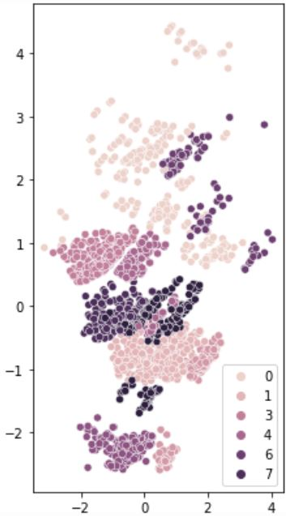

# Customer-Segmentation

## Description

- With appropriate data, it is possible to split up customers into different clusters so that they can be selectively targeted by marketing campaigns.
- The goal of this project is to split the customers of a store into 8 to 10 different clusters to allow for selective targeting.
- The clustering techniques that were tested were k-means clustering, agglomerative clustering, and DBSCAN.
- Principal component analysis (PCA) was used to reduce dimensionality for facilitated visualization.

## Code and Resources Used
**Python Version:** 3.9   
**Packages:** numpy, pandas, seaborn, sklearn, matplotlib, scipy, kneed, collections  
**Data Source:** https://www.kaggle.com/datasets/dev0914sharma/customer-clustering
